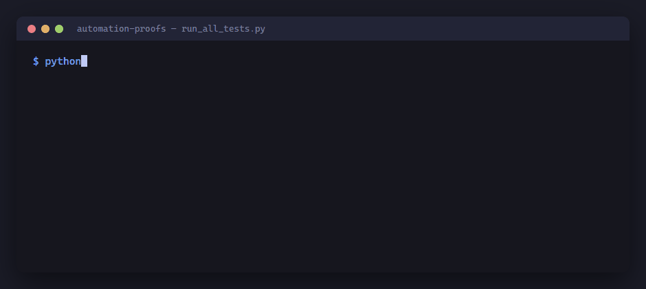

# Automation & integration — working proofs



Six small systems that connect business tools to each other. Each one runs on
your machine in under a minute, on synthetic data, with no accounts, API keys or
installs beyond Python 3.

**These are personal projects, not client work.** Nobody paid for them and
nothing here was delivered to a customer. Each was built against a real problem
statement, and each solves the part of that problem that actually causes damage
in production — not the plumbing that any tutorial covers.

The tests prove the **logic**, not the **integration**: they run against fixtures,
not against a live Airtable base or WhatsApp account. Every README says which is
which.

---

## The six

| | What it solves | Run it | Tests |
|---|---|---|---|
| **[grant-intake](grant-intake/)** | A grant-application backend. Validates, deduplicates and routes submissions, so nothing is ever silently dropped: every application comes out either accepted or in an exceptions queue with a reason attached. Ships with an Airtable schema, a Make.com design and a runbook written for non-technical staff. | `python3 tests/test_todo.py` | 13 |
| **[opt-in-relay](opt-in-relay/)** | An email opt-in form that posts to an external ESP. Reads literally, that design puts the ESP key in the page source and loses the lead every time the ESP is slow or returns 429. This is the version that does neither. | `python3 test_demo.py` | 15 |
| **[email-to-crm-identity](email-to-crm-identity/)** | An automation sends an email; the CRM needs to show it on the right contact. That is an identity-resolution problem, and a retry must not log the activity twice. | `python3 test_demo.py` | 14 |
| **[whatsapp-appointment-replies](whatsapp-appointment-replies/)** | Appointment reminders over WhatsApp. A reply brings a phone number, and a phone number is not an identity — households and reception desks cover several appointments. Resolves each reply to one appointment, and refuses replies to a slot that has since moved. | `python3 test_demo.py` | 10 |
| **[supplier-feed-normaliser](supplier-feed-normaliser/)** | Several dropshipping suppliers, each with its own idea of what "in stock" means and its own staleness. The expensive failure is not an error — it is a number that was true an hour ago. | `python3 test_supplier_sync.py` | 8 |
| **[bot-handoff-state-machine](bot-handoff-state-machine/)** | "Stop the bot when a human answers" sounds like one flag. It's a state machine: only one human can claim a conversation, the bot never answers once a human owns it, and an idle human with an unanswered message re-escalates instead of going silent. | `python3 test_demo.py` | 18 |

**78 tests.** Standard library only. No dependencies.

## Run everything

```bash
python3 run_all_tests.py
```

Or open any one folder and run the command in the table above. Each project is
self-contained; there is nothing shared between them to install first.

## Why they are shaped like this

Each project attacks the part that is hard to get right, and skips the part that
is easy. Connecting a form to a spreadsheet is a tutorial. Deciding what happens
when the row is written and the notification is not — that is the work.

So in every one of these you will find the same three things:

- **A failure that stays visible.** Nothing fails silently. Where a run can half
  succeed, there is a record of it somewhere a person will look.
- **Idempotency where retries exist.** A redelivered webhook, a double tap, a
  retried send. Each of these writes once.
- **A runbook or a README a non-developer can follow**, including what each error
  means and what to do about it — because a system nobody else can operate is a
  system you are stuck maintaining forever.

## What these do not prove

Without a client's credentials, these tests demonstrate logic and not
integration. Saying otherwise would be claiming experience that does not exist.
Where a real connection is needed, the runbook turns the first real run into a
guided step, rather than something already claimed as verified.
